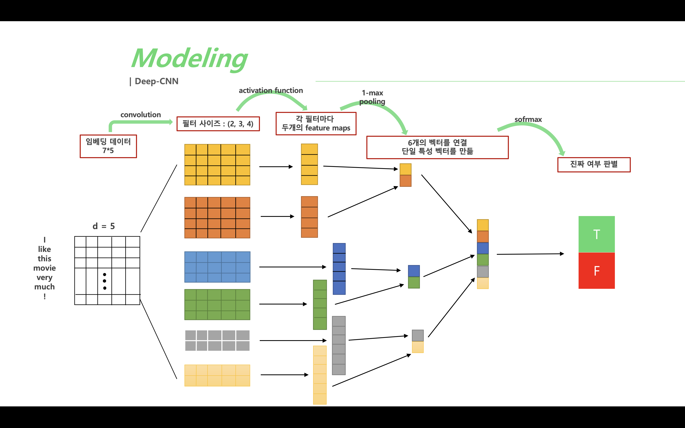
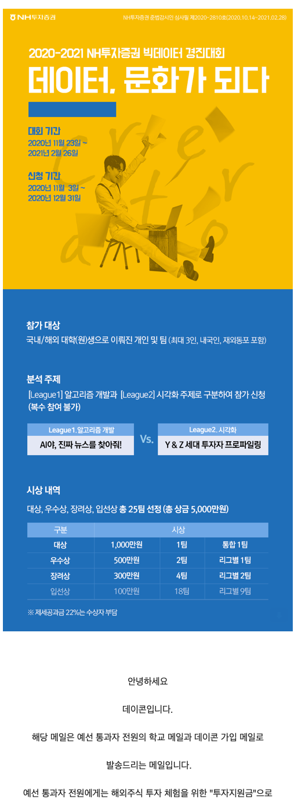

# 2020_Fake_news
---

This repo contains a NLP classification task. Folder : 1~7 - EDA, and validation part are not included since this repo wrote for submitting to contest. \
Source of dataset is from https://dacon.io/competitions/official/235658/overview/description. \

# Evaluation of Contest
- Accuracy : 70%
- Time : 30%

I pass Preliminary round.

# Environment
This was took under Colab.

# Model
1. Deep-CNN
2. Attention-Bidirectional-LSTM
3. Bidirectional-LSTM

-> **Deep-CNN** wins!

# Result of Model
|Embedding|model|time|validation acc|
|---|---|---|---:|
|Word2Vec|Deep-CNN|18.5|0.98|
|Word2Vec|Attention-Bidirectional-LSTM|55.3|0.96|
|Word2Vec|Bidirectional-LSTM|34.7|0.96|
|FastText|Deep-CNN|20.7|0.99|
|FastText|Attention-Bidirectional-LSTM|47.5|0.96|
|FastText|Attention-Bidirectional-LSTM|57.5|0.96|

# Result of Contest
I pass Preliminary round.

